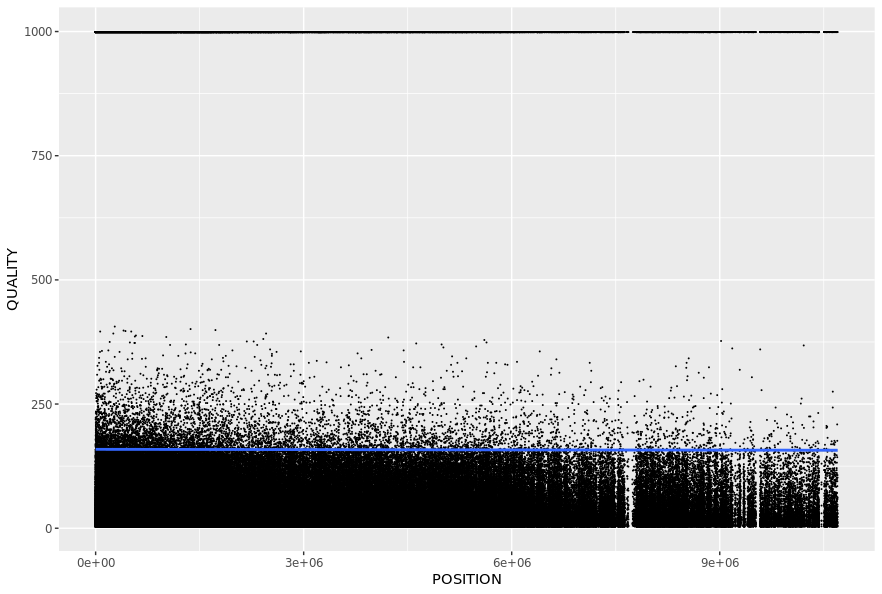

# DISTRIBUTION OF PHRED QUALITIES OVER THE WHOLE GENOME AND BY CHROMOSOME
This repository represents an UNIX and a R code to carry distribution of PHRED qualities over the genome (whole and by chromosome) of Luscinia. It is a solution of the final exercise at the course on Unix and work with genomic data.

## Run the code step by step
### Prepare working directory
The script will create a directory for data and copy the input file into it. The outputs of the script will also be put in the data directory. It is up to you to set a directory where you want it to do this. You can create a new one by `mkdir`. Put the scripts in the directory you chose (and make sure, it is the current working space as well).
Now everything is ready for running the first script that will get just the parts of the input file that we are interested in and save to new files. We are interested in chromosome, position and quality. The commands below will make the script executable and run it.

```bash
chmod +x quality-data-prep.sh

./quality-data-prep.sh
```

Now there are 2 new files in the data directory: data-gen-prep.tsv and data-chr-prep.tsv. These are used as input files in R script. The R script (quality.R) will create resulting graphs. Run it for example in RStudio.

## Resulting ggplot2 graphs
These are the resulting graph made by `quality.R` script.
### Resulting graph over the whole genome
The graph displays the distribution of quality over the whole genome.



### Resulting graph over the chromosomes
The graph displays the distribution of quality over the chromosomes. It is made for the first five chromosomes (chr1, chr2, chr3, chr4, chr5) in order to compare them. It is not possible to picture too many chromosomes at once, so the first five were chosen as a sample. 


